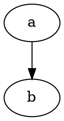

# Overview

[](https://quay.io/repository/rbean/markdown-to-confluence) [](https://travis-ci.org/github/ralphbean/markdown-to-confluence/builds)

This is a utility that will convert a directory of markdown files to Confluence
wiki markup and publish them.


## Authentication

The `CONFLUENCE_USERNAME` and `CONFLUENCE_PASSWORD` environment variables must
be set to the username and password of an account with appropriate permissions.


## Confluence and Markdown

To link to other Confluence documents, use the `confluence:` pseudo-protocol.
If the spaces are not escaped as `%20`, make sure to wrap the specifier with
`<>`.

```
[This text is ignored](<confluence:SPACE:Destination Page Title>)
```

To link to anchors in the same document, use `#anchor-name` as the link
destination. To see the name of the anchor for a particular title, inspect the
dry run output. Search for anchor elements that look like the following example
(where `anchor-name` is the text to find and use):

```
<ac:structured-macro ac:name="anchor"><ac:parameter ac:name="">anchor-name</ac:parameter></ac:structured-macro>
```

Code blocks with the `dot` class are automatically processed with graphviz, but
it is not provided with this image. To use this feature, commit another layer
with the results of `yum install -y graphviz` and use the resulting container
image instead. Note that this will result in the addition of more than 90
packages (over 100MiB total) to the image.

````

````

# Examples

To mount the current working directory at `/src` and have
[markdown-to-confluence.py](bin/markdown-to-confluence.py) process all the
`.md` files in the `doc` subdirectory recursively:

```
$ podman run --rm -it -v .:/src:Z quay.io/rbean/markdown-to-confluence \
    --confluence-url https://confluence.example.org \
    --confluence-space SPACE \
    --root /src --path doc --dry-run
```

To start the container with the current working directory at `/src` and work
interactively:

```
$ podman run --rm -it -v .:/src:Z --entrypoint /bin/bash \
    quay.io/rbean/markdown-to-confluence
# markdown-to-confluence.py \
    --confluence-url https://confluence.example.org \
    --confluence-space SPACE \
    --root /src --path doc --dry-run
```

## Running Tests

In order to run the tests, you will need to have `pandoc` and `tox` installed.
A container definition with a minimal setup environment is included in the
`tests` directory. Use the repository root for the build context:

```
$ podman build -f tests/Containerfile -t markdown-to-confluence:tox .
```

Mount the repository root as a volume when running the tests. Make sure to
include the `:Z` suffix if your system uses SELinux. The entrypoint is `tox`,
so you can pass arguments directly:

```
$ podman run --rm -ti -v .:/src markdown-to-confluence:tox -v
```

With this configuration, the `.tox` directory in the repository root will be
manipulated by the container. If you run tests frequently, it may be helpful to
define an alias:

```
tox() {
	local gitroot=$(git rev-parse --show-toplevel) || return $?
	podman run --rm -ti -v .:/src:Z "$gitroot:tox" "$@"
}
```
